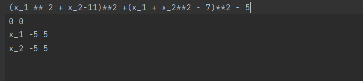
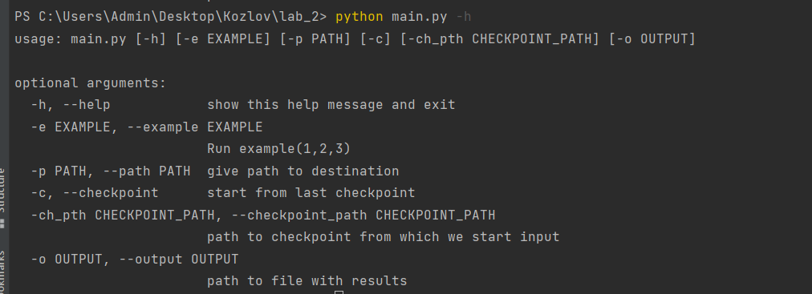
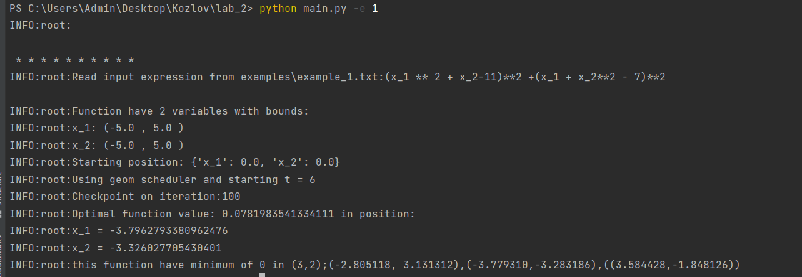

# Реализация численного отжига.
Данный репозиторий содержит в себе пример реализации алгоритма эмпирической оптимизации: численный отжиг.
Реализация состоит из нескольких модулей, имеет логирование и обработку ошибок.
Работа программы легко настраивается с помощью config.py:
* STARTING_TEMPERATURE - определяет начальную температуру отжига
* STOPPING_TEMPERATURE - условие остановки отжига
* ITERATION_PER_TEMPERATURE - сколько раз мы рассматриваем соседей за текущую температуру.

* CLOSEST_STEP - ближайшее растояние в процентах от интервала, которое мы можем пройти
* FURTHER_STEP - наибольшее растояние в процентах от интервала, которое мы можем пройти

SAVING_DIVISION_EPSILON - для избежания деления на 0 при подсчете вероятности.


* COOLING_SCHEDULE - определяет формат изменения T. Есть на выбор:
  * linear - линейный режим
  * geom - геометрический режим
  * log_1 - логарифмический режим
  * log_2 - режим коши

* linear_param - значение параметра в  линейном режиме
* geom_param - значения параметра в геометрическом режиме

* CHECKPOINT_FILE - Путь к файлу, куда записывать состояния во время исполнения
* CHECKPOINT_EVERY_COOLING - как часто относительно изменений температуры сохранять состояние

* RESULT_FILE - дефолтный файл сохранения

* DEFAULT_EXAMPLE_PATH - пример который запустится, если нет пути к Input.


# Входные данные:
Файл с исходными данными представляет из себя файл, где
* в первой строчке в питоновоском формате описывается функция, которая будет минимизирвоаться.
* во второй строчке начальные значения переменных.
* в последующих строчках название переменной, минимальное значение, максимальное значение

# Запуск программы:


Таким образом самый простой вызов программы будет
```
python main.py
```
Который запустит рассчет по дефолтному инпуту.

Можно рассмотреть примерные варианты, которые дадут информацию о минимуме значений функции:
````commandline
python main.py -e 1
````

Запуск на вашем inpute c outputОм будет выглядеть как
```commandline
python main.py -p input_path -o output_path
```

Запуск с какого то checkpoint-а выглядит так:
```commandline
python main.py -p input_path  -c -ch_pth checkpoint_path
```
# Требования
Python > 3.7

# Изучение времени и точности алгоритма
В репозитории присутствует функция algo_test.py для исследования временной сложности алгоритма и его точности.
  
Функция calc_time_complexity() отвечает за временной анализ сложности.
Запустив ее с COOLING_SCHEDULE = "geom" и параметром охлаждения = geom_param = 0.75  
на функции "x^2 + y^2 - x*y + x - y" я получил оценку временной сложности:
Time complexity: 12884.6867.

Функция accuracy() отвечает за оценку точности выполнение алгоритма.
Возьмем двухмерную функцию из example_1.txt и возьмем максимальное количество шагов = 20.
Сделаем 20 запусков, где будем запускать оптимизацию с разным количеством допустимых вызовов функций.
Посчитаем для всех запусков худший случай, лучший случай, средний случай и отклонение.
Запустив ее с COOLING_SCHEDULE = "geom" и параметром охлаждения = geom_param = 0.85 получим оценку точности:

* worst: 3.661135926290486  
* best: 0.028920225621726643  
* mean: 0.8009275518142329  
* median: 0.5231811135393163  
* std: 0.8364133142260313  

Process finished with exit code 0
